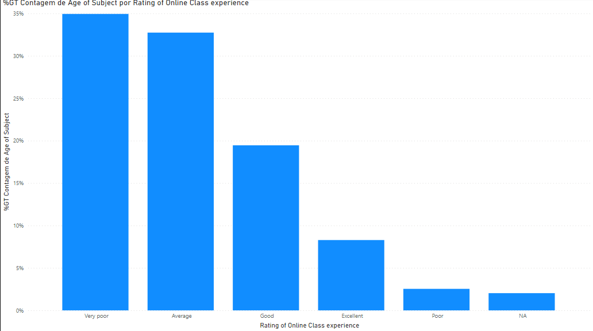

```{r setup, include=FALSE}


#------------------------------------------------------------------------
require(pacman)

pacman::p_load(leaflet, leaflet.extras, leaflet.providers, 
               leafem, htmlwidgets, dplyr, htmltools, rgdal, 
               leafem, mapview, tmap, ggplot2)
#------------------------------------------------------------------------

paises <- readOGR("countries.geojson")

# dados:

# logo:
m <- "https://images.vexels.com/media/users/3/143561/isolated/preview/afa3aa927b63061e3b0222b7dab9cdbf-ubicaci--n-n--utica-norte-flecha-vintage-by-vexels.png"

AA <- leaflet(paises) %>%
  addControl(html = "<p><strong><em>Título</em></strong></p>", position ="topright")%>%
  
  addLogo(m,url = "https://images.vexels.com/media/users/3/143561/isolated/preview/afa3aa927b63061e3b0222b7dab9cdbf-ubicaci--n-n--utica-norte-flecha-vintage-by-vexels.png",
          position = "topleft", offset.x = 50, offset.y = 10, width = 100, height = 100) %>%
  
  addProviderTiles(providers$OpenStreetMap) %>%
  
  setView(lng = 90, lat = 10, zoom = 1) %>%
   
  addLayersControl(baseGroups = c("OSM","Satellite"), 
                   overlayGroups = c("Study Area"),
                   position = "topright", options = layersControlOptions(collapsed = TRUE)) %>%
  
  addProviderTiles(providers$OpenStreetMap, group = "OSM") %>%
  
  addProviderTiles(providers$Esri.WorldImagery, group = "Satellite") %>%
  
  addMiniMap(tiles = providers$Esri.WorldImagery, toggleDisplay = TRUE) 


### outros gráficos

graph2 <- mtcars %>%
 ggplot() +
 aes(x = mpg, y = drat, colour = as.factor(gear)) +
 geom_point(shape = "circle", size = 1.5) +
 labs(x = "Miles per Galoon", colour = "gear")+
 theme_minimal()

graph3 <- CO2 %>% 
  ggplot() +
  aes(x = conc, y = uptake, colour = as.factor(Treatment)) +
  geom_point(shape = "circle", size = 1.5) +
  labs(x = "Concentration", colour = "treatment")+
  theme_minimal()


```


Título geral
===================================== 

Column {data-width=250}
-----------------------------------------------------------------------

### Gráfico 1

```{r map}
AA
```

Column {data-width=250}
-----------------------------------------------------------------------

### Gráfico 2

```{r echo=FALSE, out.width="100%"}

```

### Gráfico 3

```{r map1, out.width="100%"}
graph3                                                  
```


Information {data-orientation=rows data-icon="fa-info-circle"}
===================================== 

### Hackathon report

At this report there are the main results from the Hackathon challenge with the objective of become 
easier to spread our analysis throughout community
about the COVID-19 impact for the SDG3 (Health & Well-Being) and SD4 (Quality Education). 

 
Furthermore, about 90% of countries, suffered disruption of health services (UN, 2021).

Based on literature, the things related to the consequences of this health problem for several SDGs, emphasise that due to the COVID-19 pandemic, the linkages between the most effected SDGs are intensified and their impact on other Goals is increased. Between those most affected SDGs are the SDG3 and the SDG4 that's why we chose them.

\  

Therefore we used the following databases to find out how the impact...:

* x [link]()

* y [link]()

\   

The main variables selected to generate these analysis were:

* w

* z

\   

You can see all the data used during this challenge through this [link](https://github.com/Gabrielforest/hackathon_/tree/main/data) and the repository with the code [here](https://github.com/Gabrielforest/hackathon_)

\  

``` authors: Eloabe; Gabriel; Gustavo; Pedro; Hugo ```

\blue{References:} 

UN (2021) Progress towards the Sustainable Development Goals Report of the Secretary-General. Microsoft Word - SG SDG Progress report 2021 unedited

